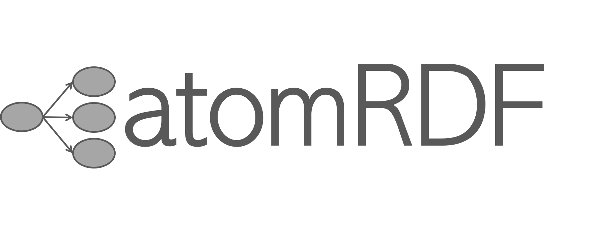

[](https://doi.org/10.21105/joss.09482)
---


**tools4RDF** is a Python toolkit for working with RDF data, SPARQL queries, and semantic networks. 

It allows one or more ontologies to be parsed and represented as Python classes, making it easier to navigate and explore their structure through features like autocompletion in interactive environments such as Jupyter notebooks. 

The aim is to make querying knowledge graphs with SPARQL more accessible to users without deep expertise in semantic
web technologies.

---

## 🚀 Features

- Load and serialize RDF graphs (Turtle, RDF/XML, N-Triples, etc.)
- Compose and run SPARQL queries programmatically
- Auto-discover ontology terms via dot-access
- Query graphs and return results as `pandas` DataFrames
- Perform graph merging and basic path reasoning

---

## 📦 Installation

```bash
pip install tools4rdf
```

Or:

```bash
conda install -c conda-forge tools4rdf
```

---

## 📘 Example

```python
from tools4rdf import OntologyNetwork
onto = OntologyNetwork('http://xmlns.com/foaf/0.1/')
df = onto.query(
    'https://dbpedia.org/sparql',
    onto.terms.foaf.Person,
    onto.terms.foaf.familyName,
    limit=10,
)
```

More examples available in the [docs](https://tools4rdf.readthedocs.io/en/latest/).

---

## 📄 License

MIT License

---

## 🤝 Contributing

Issues and pull requests are welcome! Feel free to suggest new utilities or improvements.

## Citation

If you use tools4RDF in your work, please cite:

Menon, S., Guzmán, A. A., Waseda, O., Sandfeld, S., & Hickel, T. (2026). tools4RDF: A Python toolkit for working with RDF data. Journal of Open Source Software, 11(117), 9482. https://doi.org/10.21105/joss.09482

## 📌 Acknowledgement
This work is supported by the [NFDI-Matwerk](https://nfdi-matwerk.de/) consortia.

Funded by the Deutsche Forschungsgemeinschaft (DFG, German Research Foundation) under the National Research Data Infrastructure – NFDI 38/1 – project number 460247524

